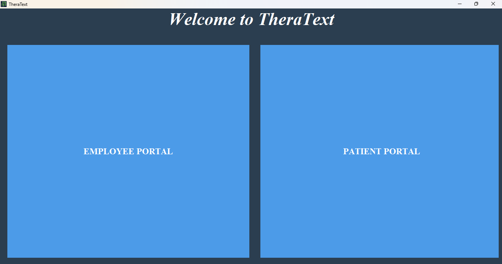
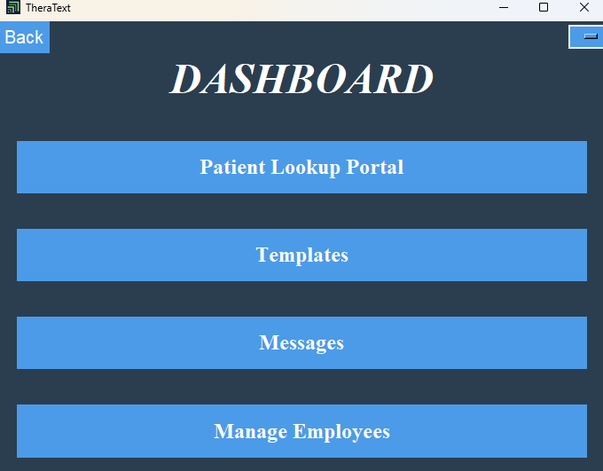

Scroll to see some of the sneak peak images of the TheraText software. The software is customizable and has a variety of features. Some examples are listed and shown below.

🌟Start here!🌟 This is the starting screen. The TheraText software is compatible for both practice employees and patients. 

<!-- Two -->
<section id="two" class="spotlights">
	<section>
		
		

			

				<header class="major">
					<h3>A Tour of the 🚀TheraText Solution🚀</h3>
				</header>
				
This is the starting screen. The TheraText software is compatible for both practice employees and patients. Encrypted and secure sign in for both the employee portal and patient portal. Users select whether to enter the employee portal or the patient portal. This login portal keeps information and data secure.

				<ul class="actions">
					<li><a href="generic.html" class="button">Learn more</a></li>
				</ul>
			

		

	</section>

   
	<section>
		
		

			

				<header class="major">
					<h3>👩🏽‍⚕️Tailored to each Care Provider👩🏽‍⚕️</h3>
				</header>
				
TheraText offers customizable dashboards. Navigate TheraText’s solutions by clicking the buttons in the center of the screen or by using the navigation bar to the right of the screen. 

				<ul class="actions">
					<li><a href="generic.html" class="button">Learn more</a></li>
				</ul>
			

		

	</section>
 

   
	<section>
		
		

			

				<header class="major">
					<h3>😁Our Templates Make Your Life Easier😁</h3>
				</header>
				
How does it feel when you are working? Stressful, exciting, neverending? No matter what, TheraText's templates go unmatched. TheraText offers customized and importable templates to make the notetaking process easy and efficient.

				<ul class="actions">
					<li><a href="generic.html" class="button">Learn more</a></li>
				</ul>
			

		

	</section>
</section>

   
<!-- Three -->
<section id="three">
	

		<header class="major">
			<h2>🖥️So what really is TheraText Templates?🗒️</h2>
		</header>
		
TheraText Solutions is a notetaking software. The software is secure, organized, and keeps your data in one place.

		<ul class="actions">
			<li><a href="generic.html" class="button next">Get Started</a></li>
		</ul>
	

</section>

 Objectives: To aid care providers with (a) organization, (b) safe keeping of patient information, (c) easy billing code generation, (d) efficient note taking.
