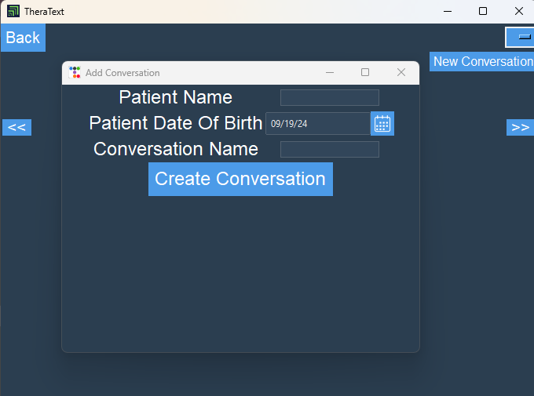

Scroll to see some of the images of the TheraText software. The software is customizable and has a wide variety of features. Some examples are listed and shown below.

Start here! This is the starting screen. The TheraText software is compatible for both practice employees and patients. 
 
Users select whether to enter the employee portal or the patient portal.

 
 Encrypted and secure sign in for both the employee portal and patient portal.

TheraText offers customizable dashboards. Navigate TheraText’s solutions by clicking the buttons in the center of the screen or by using the navigation bar to the right of the screen. !

