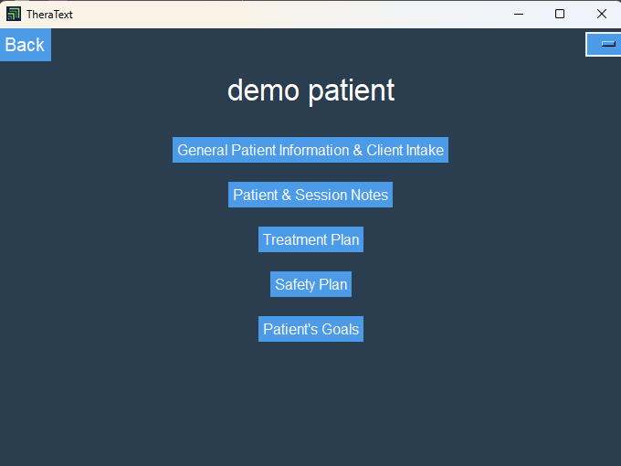

<!-- Main -->

<!-- One -->
<section id="one" style="margin-bottom: 10px;">
	

		<header class="major">
			<h2>We try to do some cool things so you can do epic things: </h2>
		
At TheraText, we help care providers with (a) organization, (b) safe keeping of patient information, (c) easy billing code generation, (d) efficient note taking, (e) safe to use AI integration.

    <!-- Adds multiple line breaks for spacing -->
<!-- Two -->
<section id="two" class="spotlights">
	<section>
		
		

			

				<header class="major">
					<h3>The TheraText Solution</h3>
				</header>
				
TheraText offers a software to keep your notes in one secure place. [Cheat sheet: Define software... Software is a computer program that provides a set of instructions and data storage to make the computer do what you want it to do.] Additionally, TheraText offers solutions when notes need to be written up. TheraText Templates offer a way to reduce the amount of time you spend typing your notes. Easily create different patient plans, intake patients, or document using TheraText.

				<ul class="actions">
					<li><a href="generic.html" class="button">Learn more</a></li>
				</ul>
			

		

	</section>
	    <!-- Adds multiple line breaks for spacing -->
	<section>
		
		

			

				<header class="major">
					<h3>Login Portal</h3>
				</header>
				
Start here! This is the starting screen. The TheraText software is compatible for both practice employees and patients. Users select whether to enter the employee portal or the patient portal. This login portal keeps information and data secure. Data is encrypted within the TheraText platform with a built-in encryption system.

				<ul class="actions">
					<li><a href="generic.html" class="button">Learn more</a></li>
				</ul>
			

		

	</section>
	    <!-- Adds multiple line breaks for spacing -->
	<section>
		
		

			

				<header class="major">
					<h3>Tailored to each Care Provider</h3>
				</header>
				
TheraText offers customizable dashboards. Navigate TheraText’s solutions by clicking the buttons in the center of the screen or by using the navigation bar.

				<ul class="actions">
					<li><a href="generic.html" class="button">Learn more</a></li>
				</ul>
			

		

	</section>
</section>
    <!-- Adds multiple line breaks for spacing -->
<!-- Three -->
<section id="three">
	

		<header class="major">
			<h2>An Example TheraText Template</h2>
			
Customizable and importable templates by TheraText make the notetaking process easy and efficient. Templates mean more organization and less typing for you. 

			
		</header>
		<ul class="actions">
			<li><a href="generic.html" class="button next">Get Started</a></li>
		</ul>
	

</section>
